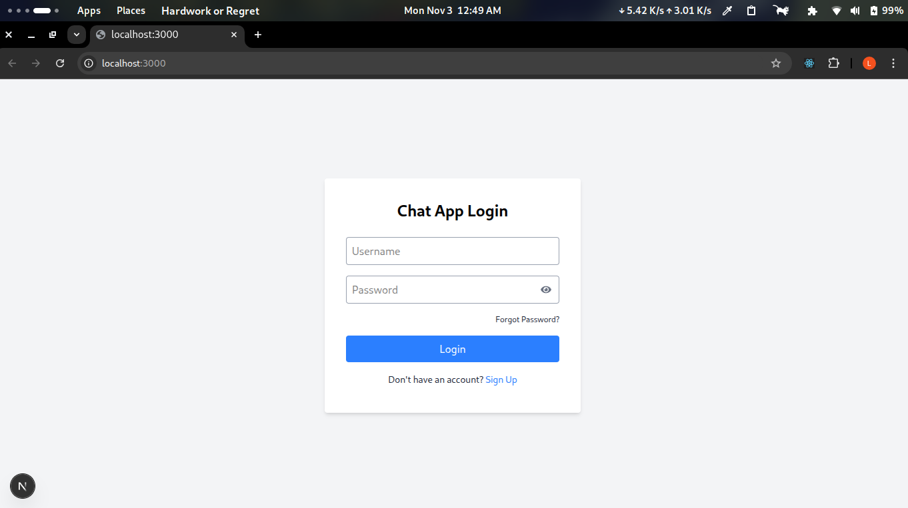
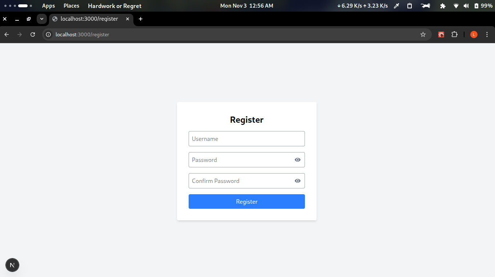
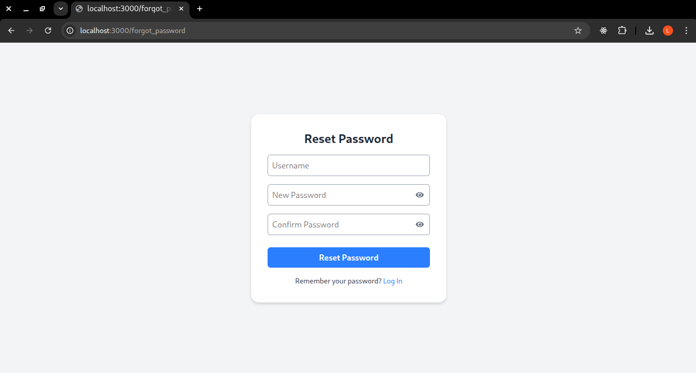
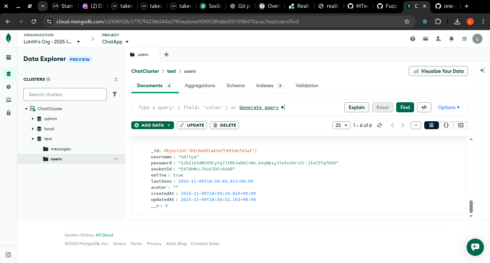

# 💬 Real-Time Chat Application

A modern **one-to-one real-time chat application** built with **Next.js, MongoDB, and Socket.io**.  
It supports **user registration, login, persistent chat history, and instant message delivery** using WebSockets.


## 🧭 Project Overview

This project demonstrates how to build a **full-stack chat app** that allows registered users to:
- Send and receive messages in real time using Socket.io.
- Maintain message history stored in MongoDB.
- Search list of all registered users.
- See recent chat contacts automatically sorted by activity.
- Enjoy seamless synchronization between multiple clients.

The app combines REST APIs for persistence and Socket.io for real-time bi-directional communication.


## ⚙️ Installation & Running Locally

### 🧩 Prerequisites
| Tool                                                      | Description                               | Version |
| --------------------------------------------------------- | ----------------------------------------- | ------- |
| [Node.js](https://nodejs.org/)                            | JavaScript runtime for backend            | >= 18.x |
| [MongoDB](https://www.mongodb.com/try/download/community) | Database for storing user data & messages | Latest  |


### 1️⃣ Clone the repository
```bash
git clone https://github.com/MTech-IT-MNS-2025/Group-3.git
cd Assignment_3
```
### 2️⃣ Install dependencies
```bash
npm install
```
### 3️⃣ Configure environment variables
Create a .env.local file in the project root:
```bash
MONGO_URI={mongodblink}

# For offline (organization LAN) set USE_ONLINE_DB=false

# For online
USE_ONLINE_DB=true
PORT=3000
JWT_SECRET={your-very-secure-secret}
```

### 4️⃣ Run in development
```bash
npm run dev
```

### 5️⃣ Open in browser
Visit:
👉 http://localhost:3000


## 🖼️ Screenshots
### 📸 Login Interface

### 📸 Register Interface

### 📸 Forgot Password Interface

### 📸 Chat Interface

### 📸 Mongodb


---


## 🏗️ Architecture Overview
``` text
chat-app/
├── package.json              # Project metadata and dependencies
├── next.config.js            # Next.js configuration
├── .env.local                # Environment variables (MongoDB URI, PORT, secrets)
├── public/                   # Static files (images, icons, etc.)
│   └── favicon.ico
├── styles/                   # CSS or global styles
│   └── globals.css
├── lib/                      # Helper modules
│   ├── db.js                 # MongoDB connection logic
│   └── socket.js             # Socket.io server logic
├── models/
│   ├── User.js               # UserSchema from mongodb
│   └── Message.js 	          # MessageSchema from mongodb
├── pages/                    # Next.js pages (frontend + backend API)
|   ├── _app.js		          # Apply global css to all the pages
│   ├── index.js              # Homepage / login page
│   ├── chat.js               # Chat UI page (frontend)
|   ├── register.js	          # Register a new user
|   ├── forgot_password.js    # Forgot Password
│   └── api/                  # Backend API routes
│       ├── users.js          # User signup/login API
│       ├── messages.js       # Fetch/save chat messages API
│       └── socket.js         # API route for Socket.io server (development)
├── components/               # Reusable React components
│   ├── MessageBubble.js
│   ├── ChatInput.js
│   └── UserList.js
├── hooks/                    # React custom hooks
│   └── useSocket.js          # Hook for Socket.io client connection
├── public/                   # public module for app interface images
│   └── screenshots/
|       ├── MessageBubble.js
│       ├── ChatInput.js
│       └── UserList.js
└── README.md                 # Project description
```


## 🧰 Technologies Used
| Category       | Technology                          | Purpose                 |
| -------------- | ----------------------------------- | ----------------------- |
| **Frontend**   | Next.js (React + SSR)               | UI, routing, APIs       |
| **Backend**    | Node.js + Express (Next API Routes) | REST API endpoints      |
| **Database**   | MongoDB + Mongoose                  | User & message storage  |
| **Real-time**  | Socket.io                           | Real-time communication |
| **Auth**       | JWT (JSON Web Tokens)               | Authentication          |
| **Styling**    | Tailwind CSS                        | Modern UI styling       |
---


## 📚 Learning Outcomes

Through this project, you will learn:

+ How to integrate Socket.io with Next.js for real-time features. 
+ How to structure a full-stack Next.js application with APIs, DB, and sockets. 
+ How to persist chat data in MongoDB and retrieve conversation history. 
+ How to design React components for chat interfaces (UserList, ChatWindow). 
+ How to manage authentication using JWT. 
+ How to prepare and deploy a full-stack app to production.

## 📜 License
This project is licensed under the MIT License.  
See the [LICENSE](../LICENSE) file for details.

---
