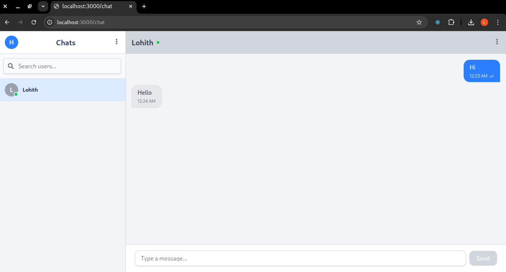
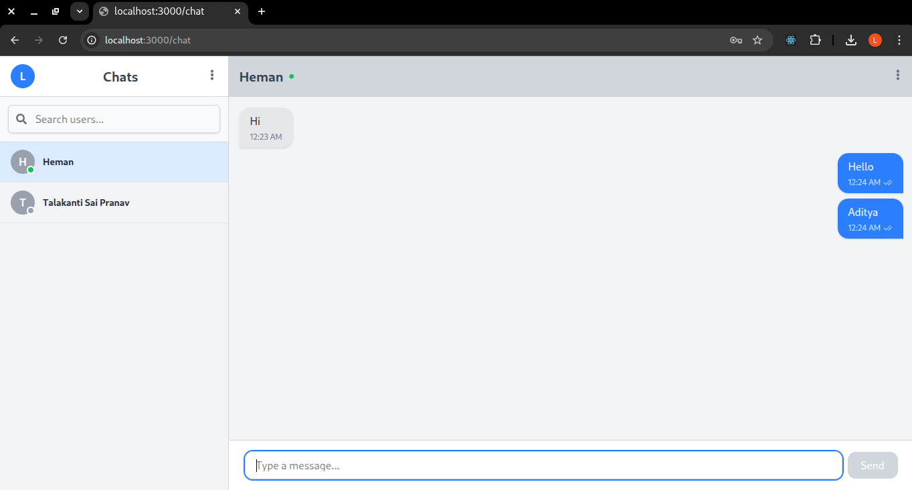

# 💬 Real-Time Chat Application

A modern **one-to-one real-time chat application** built with **Next.js, MongoDB, and Socket.io**.  
It supports **user registration, login, persistent chat history, and instant message delivery** using WebSockets.


## 🧭 Project Overview

This project demonstrates how to build a **full-stack chat app** that allows registered users to:
- Send and receive messages in real time using Socket.io.
- Maintain message history stored in MongoDB.
- Search list of all registered users.
- See recent chat contacts automatically sorted by activity.
- Enjoy seamless synchronization between multiple clients.

The app combines REST APIs for persistence and Socket.io for real-time bi-directional communication.


## ⚙️ Installation & Running Locally

### 🧩 Prerequisites
| Tool                                                      | Description                               | Version |
| --------------------------------------------------------- | ----------------------------------------- | ------- |
| [Node.js](https://nodejs.org/)                            | JavaScript runtime for backend            | >= 18.x |
| [MongoDB](https://www.mongodb.com/try/download/community) | Database for storing user data & messages | Latest  |


### 1️⃣ Clone the repository
```bash
git clone https://github.com/MTech-IT-MNS-2025/Group-3.git
cd Assignment_3
```
### 2️⃣ Install dependencies

```bash
npm install
```
### 3️⃣ Configure environment variables
Create a .env.local file in the project root:
```bash
MONGO_URI={mongodblink}

# For offline (organization LAN) set USE_ONLINE_DB=false

# For online
USE_ONLINE_DB=true
PORT=3000
JWT_SECRET={your-very-secure-secret}
```

### 4️⃣ Run in development
```bash
npm run build
npm start
```

### 5️⃣ Open in browser
Visit:
👉 http://localhost:3000


## 🖼️ Screenshots
### 📸 Login Interface

### 📸 Register Interface

### 📸 Forgot Password Interface

### 📸 Chat Interface


### 📸 Mongodb


---


## 🏗️ Architecture Overview
``` text
chat-app/
├── components/
│ ├── ChatInput.js 			 # Chat text input box with typing and send functionality
│ ├── MessageBubble.js 	 # Displays individual chat messages (sent/received)
│ └── UserList.js 			 # Sidebar list showing users, unread count, and online status
│
├── hooks/
│ └── useSocket.js 			 # Custom React Hook for managing Socket.IO client connection
│
├── lib/
│ ├── db.js 					   # MongoDB connection helper using Mongoose
│ └── socket.js 				 # Socket.IO server setup and real-time presence management
│
├── models/
│ ├── Message.js 				 # Message schema: sender, receiver, text, seen/unseen tracking
│ └── Users.js 				   # User schema: username, password, online status, lastSeen, etc.
│
├── pages/
│ ├── api/ 						   # Backend API routes (handled by Next.js)
│ │ ├── message.js 			 # Send and fetch messages API
│ │ ├── messages/
│ │ │ └── mark-seen.js 	 # Marks messages as seen (updates DB + emits socket event)
│ │ ├── socket.js 			 # Initializes the Socket.IO server (used by frontend)
│ │ └── users.js 				 # Handles user registration, login, and user fetching
│ │
│ ├── _app.js 					 # Root wrapper for all pages (global styles, dark mode, toaster)
│ ├── chat.js 					 # Main chat UI page with socket events and message rendering
│ ├── forgot_password.js # Forgot password page (optional for recovery feature)
│ ├── index.js 				   # Login page (entry point for users)
│ └── register.js 			 # Registration page for new users
│
├── styles/
│ └── global.css 				 # TailwindCSS base styles and dark mode configuration
│
├── server.js 					 # Custom Express + Socket.IO server (runs Next.js app)
├── public/
│   └── screenshots/     # App interface screenshots or static assets
|
├── next.config.js 		   # Next.js configuration file (build settings, optimizations)
├── tailwind.config.js 	 # TailwindCSS configuration (themes, dark mode, colors)
├── postcss.config.js 	 # PostCSS setup for TailwindCSS processing
│
├── package.json 				 # Project dependencies, scripts, and metadata
├── package-lock.json 	 # Locked dependency versions for consistent installs
└── Readme.md 					 # Documentation, setup instructions, and developer guide
```


## 🧰 Technologies Used

| **Category**     | **Technology**               | **Purpose** |
|------------------|-----------------------------|--------------|
| **Frontend**     | Next.js (React + SSR)        | UI rendering, routing, API handling |
| **Backend**      | Node.js + Next.js API Routes | API logic for users & messages |
| **Database**     | MongoDB + Mongoose           | Persistent user/message storage |
| **Real-time**    | Socket.IO                    | Live messaging, typing, presence |
| **Auth**         | JWT (JSON Web Token)         | User authentication |
| **Styling**      | TailwindCSS + Dark Mode      | Responsive and modern UI design |

---

## 🌐 Key Features
✅ Real-time messaging via Socket.IO  
✅ Online/offline presence tracking  
✅ Message seen/unseen tracking  
✅ Typing indicator updates  
✅ JWT-based authentication  
✅ Dark/light theme toggle  
✅ Responsive UI using TailwindCSS  
✅ Scalable structure for future expansion  

---


## 📚 Learning Outcomes

Through this project, you will learn:

+ How to integrate Socket.io with Next.js for real-time features. 
+ How to structure a full-stack Next.js application with APIs, DB, and sockets. 
+ How to persist chat data in MongoDB and retrieve conversation history. 
+ How to design React components for chat interfaces (UserList, ChatWindow). 
+ How to manage authentication using JWT. 
+ How to prepare and deploy a full-stack app to production.

## 📜 License
This project is licensed under the MIT License.  
See the [LICENSE](../LICENSE) file for details.

---
