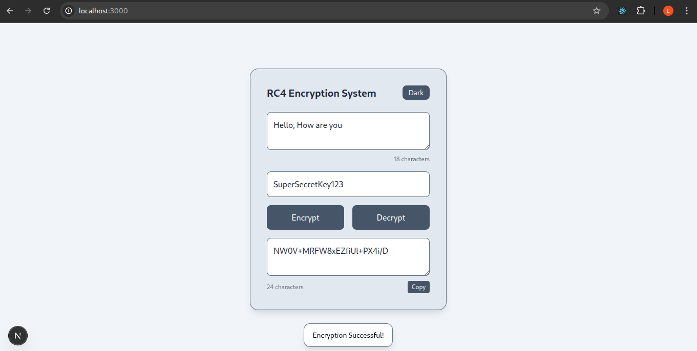
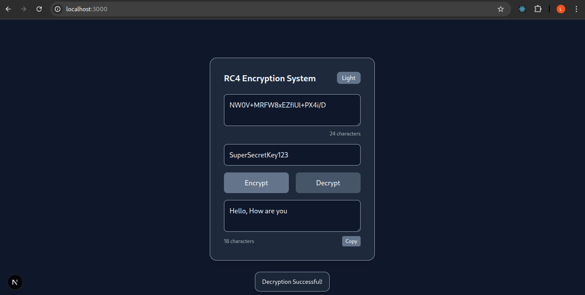

# 💬 RC4 Encryption System (WASM + Next.js)

A Web-based **RC4 Encryption/Decryption System** demonstrating how **native C code** can be compiled to **WebAssembly (WASM)** using **Emscripten** and executed inside a **Next.js frontend**.
This project shows end-to-end integration of C → WASM → JavaScript, enabling secure and fast encryption directly in the browser.

---

## 🧭 Project Overview

This project was developed to help understand how low-level C programs can run on the web through WebAssembly.
You will implement the **RC4 stream cipher in C**, compile it to **WASM**, and call it from a **Next.js** frontend.

The application provides:

* A text input for plaintext / ciphertext
* A text input for the secret key
* Buttons to encrypt and decrypt the text
* An output section that displays the RC4 result using WebAssembly execution

The entire flow demonstrates:

C ➝ Emscripten ➝ WebAssembly ➝ JavaScript ➝ Next.js UI

---

## 🧰 Technologies Used

| **Category**     | **Technology**                   | **Purpose**                             |
| ---------------- | -------------------------------- | --------------------------------------- |
| **Core Logic**   | C (RC4 implementation)           | Encryption/decryption algorithm         |
| **WASM Engine**  | Emscripten                       | Compiling C → WebAssembly + JS bindings |
| **Frontend**     | Next.js (React)                  | UI, routing & browser interaction       |
| **WASM Runtime** | WebAssembly API (via Emscripten) | Execute compiled C functions in browser |
| **Styling**      | TailwindCSS                      | Modern, responsive UI                   |

---

## 🌐 Key Features

* 🔐 **RC4 Encryption & Decryption** performed using C compiled to WASM
* ⚡ **High-performance execution** of encryption logic in the browser
* 🔄 **Two-way communication** between JavaScript memory and WASM memory
* 🧪 Clean UI with:

  * Plaintext/Ciphertext input
  * Secret key input
  * Encrypt button
  * Decrypt button
* 🖥️ **Real-time output display** after WASM invocation
* ♻️ Works entirely client-side (no backend required)

---

## 🎯 Objective

To learn how native C programs can be compiled to **WebAssembly** using **Emscripten**, and how to invoke these functions from a **Next.js** frontend to perform encryption and decryption in the browser.

---

## 📚 Learning Outcomes

✔️ How to compile C code into WebAssembly using Emscripten   
✔️ How to expose C functions to JavaScript via Emscripten bindings  
 ✔️ How to call native C/WASM functions from a Next.js application  
 ✔️ How to manage data between JS memory and WASM memory  
 ✔️ How to design a simple Web UI that interacts with WASM logic 

---

## 🛠️ Steps Implemented

### **Step 1: Implement RC4 in C**

* A complete RC4 implementation was written manually (no crypto libraries).
* The file is located at:
  `public/rc4.c`

### **Step 2: Compile C ➝ WebAssembly using Emscripten**

Commands used:

```bash
emcc rc4.c -O3 \
  -s WASM=1 \
  -s MODULARIZE=1 \
  -s 'EXPORT_NAME="RC4Module"' \
  -s EXPORTED_FUNCTIONS='["_RC4","_malloc","_free"]' \
  -s EXPORTED_RUNTIME_METHODS='["ccall","UTF8ToString","stringToUTF8","getValue","setValue","HEAPU8","HEAP8","HEAP32","HEAPU32"]' \
  -o public/rc4.js
```

This generates:

* `rc4.wasm`
* `rc4.js` (JS glue code to load WASM)

Placed inside:

```
public/
│── rc4.c
│── rc4.js
└── rc4.wasm
```

### **Step 3: Create Next.js Frontend**

Frontend includes:

* Input box for plaintext/ciphertext
* Input box for key
* Encrypt button → calls WASM RC4 encrypt
* Decrypt button → calls WASM RC4 decrypt
* Output section to display results

Located in:

```
pages/index.js
hook/rc4hook.js
styles/global.css
```

---

## ⚙️ Installation & Running Locally

### 🧩 Prerequisites

| Tool       | Description                 | Version |
| ---------- | --------------------------- | ------- |
| Node.js    | JavaScript runtime          | >= 20.x |
| Emscripten | C → WASM compiler toolchain | Latest  |

### 🔧 Install Emscripten

```bash
git clone https://github.com/emscripten-core/emsdk.git
cd emsdk
./emsdk install latest
./emsdk activate latest
source ./emsdk_env.sh
```

### 1️⃣ Clone the repository

```bash
git clone https://github.com/MTech-IT-MNS-2025/Group-3.git
cd Group-3/Assignment_4
```

### 2️⃣ Install dependencies

```bash
npm install
```

### 3️⃣ Build WASM + Start Next.js

```bash
npm run build
npm start
```

### 4️⃣ Open browser

👉 [http://localhost:3000](http://localhost:3000)

---

## 🗂️ Project Structure

```text
Assignment_4/
├── hook/
│   └── rc4hook.js
├── pages/
│   ├── _app.js
│   └── index.js
├── public/
│   ├── rc4.c
│   ├── rc4.js
│   └── rc4.wasm
├── styles/
│   └── global.css
├── tailwind.config.js
├── package.json
└── README.md
```

---

## 🖼️ Screenshots

### 📸 Encryption UI



### 📸 WASM Output



---

## 📜 License

This project is licensed under the MIT License.  
See the [LICENSE](../LICENSE) file for details.

---