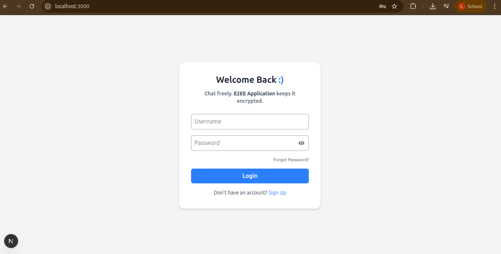
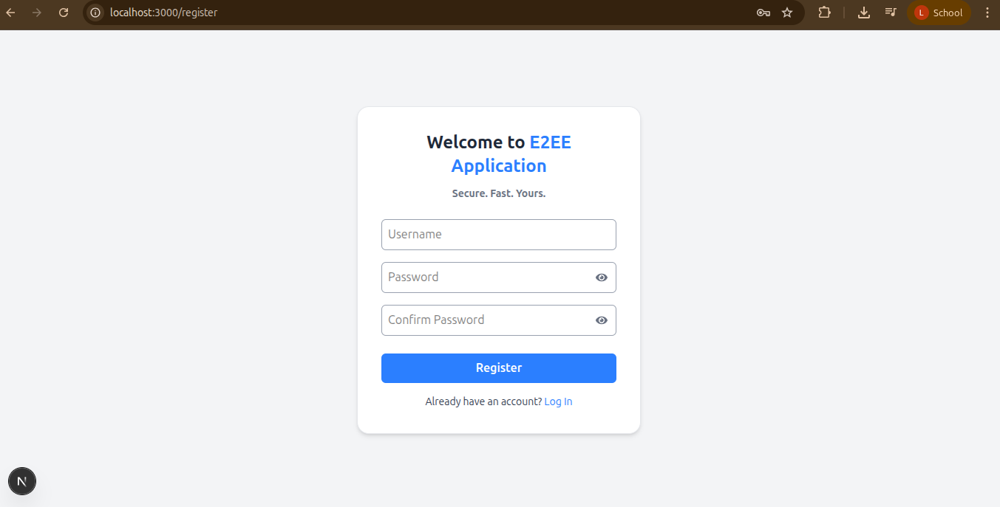
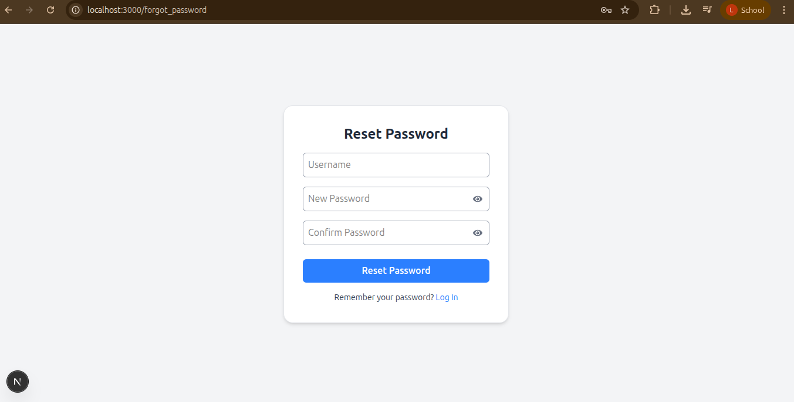
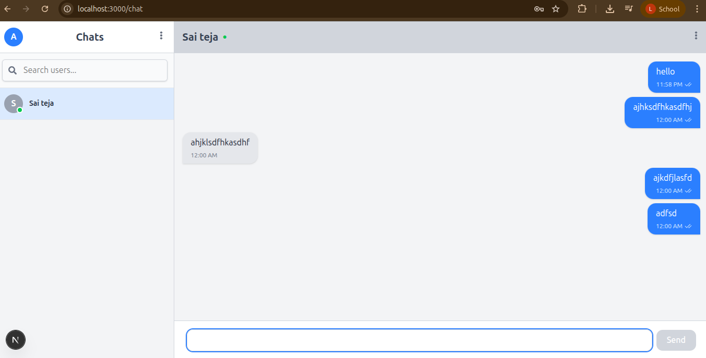
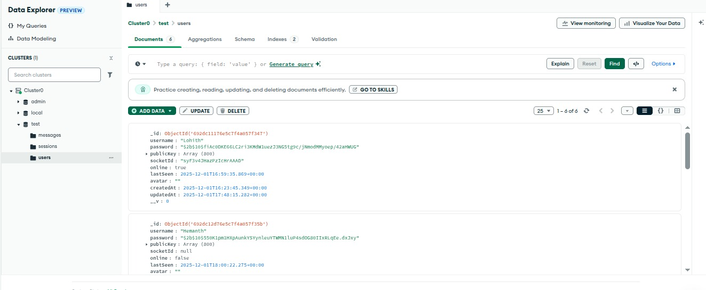

# 💬 E2EE — Real-Time One-to-One Chat App

A modern one-to-one real-time chat application built with **Next.js**, **MongoDB**, and **Socket.io**.
Supports user registration, login, persistent encrypted chat history, and instant message delivery using WebSockets. This repo contains the full stack (Next.js pages + API routes, Mongoose models, Socket.IO server, and a small WASM-based PQC wrapper for key encapsulation).


## 🧭 Project Overview

E2EE demonstrates a secure, real-time chat flow:

* Register and login users (JWT auth).
* Store user profiles and message history in MongoDB.
* Deliver messages instantly via Socket.IO with presence & typing indicators.
* Use a hybrid post-quantum KEM (WASM Kyber wrapper) + AES-GCM to protect session keys and messages.
---

## 🧭 Features

* ✅ Real-time messaging with Socket.IO
* ✅ Online/offline presence tracking
* ✅ Message seen/unseen tracking
* ✅ Typing indicators
* ✅ JWT-based authentication (login & registration)
* ✅ Persistent chat history in MongoDB
* ✅ Hybrid PQC KEM + AES-GCM session encryption (WASM Kyber)
* ✅ OS-backed secret storage for desktop (Electron + keytar) — fallback to IndexedDB for browser
* ✅ Clean React components + TailwindCSS UI
* ✅ Scalable server structure and clear API routes

---


## ⚙️ Installation & Running Locally

### 🧩 Prerequisites
| Tool                                                      | Description                               | Version |
| --------------------------------------------------------- | ----------------------------------------- | ------- |
| [Node.js](https://nodejs.org/)                            | JavaScript runtime for backend            | >= 18.x |
| [MongoDB](https://www.mongodb.com/try/download/community) | Database for storing user data & messages | Latest  |
| **WASM Engine**  | Emscripten                       | Latest |
| [Open Quantum Safe (liboqs)](https://openquantumsafe.org/liboqs/) | Liboqs library | Latest |


### 1️⃣ Clone the repository
```bash
git clone https://github.com/MTech-IT-MNS-2025/Group-3.git
cd Assignment_5
```
### 2️⃣ Install dependencies

```bash
npm install
```
### 3️⃣ Configure environment variables
Create a .env.local file in the project root:
```bash
MONGO_URI={mongodblink}

# For offline (organization LAN) set USE_ONLINE_DB=false

# For online
USE_ONLINE_DB=true
PORT=3000
JWT_SECRET={your-very-secure-secret}
```

### 4️⃣ Run in development
```bash
npm run build
npm start
```

### 5️⃣ Open in browser
Visit:
👉 http://localhost:3000


## 🖼️ Screenshots
### 📸 Login Interface

### 📸 Register Interface

### 📸 Forgot Password Interface

### 📸 Chat Interface

### 📸 Mongodb


---


## 🏗️ Architecture Overview
``` text
Assignment_5/
├── package.json              # Project metadata and dependencies
├── next.config.mjs           # Next.js configuration
├── .env.local                # Environment variables (MongoDB URI, PORT, secrets)
├── styles/                   # CSS or global styles
│   └── globals.css
├── lib/                      # Helper modules
│   ├── db.js                 # MongoDB connection logic
|   ├── crypto-utils.js
|   ├── wasmLoader.js
│   └── socket.js             # Socket.io server logic
├── models/
|   ├─  Session.js
│   ├── User.js               # UserSchema from mongodb
│   └── Message.js 	          # MessageSchema from mongodb
├── pages/                    # Next.js pages (frontend + backend API)
|   ├── _app.js		          # Apply global css to all the pages
│   ├── index.js              # Homepage / login page
│   ├── chat.js               # Chat UI page (frontend)
|   ├── register.js	          # Register a new user
|   ├── forgot_password.js    # Forgot Password
│   └── api/                  # Backend API routes
|       ├─ messages/          # Message Seen/Unseen feature
|       |    └─ mark-seen.js
|       ├── session.js
│       ├── users.js          # User signup/login API
│       ├── messages.js       # Fetch/save chat messages API
│       └── socket.js         # API route for Socket.io server (development)
├── components/               # Reusable React components
│   ├── MessageBubble.js
│   ├── ChatInput.js
│   └── UserList.js
├── hooks/                    # React custom hooks
|   ├── useSessionManager.js
|   ├── useCrypto.js
│   └── useSocket.js          # Hook for Socket.io client connection
├── public/                   # Public module for app interface images
|   ├── kyber.js
|   ├── kyber.wasm
│   └── screenshots/
|       ├── MessageBubble.js
│       ├── ChatInput.js
│       └── UserList.js
├── server.js
├── package-lock.json
├── postcss.config.cjs
├── tailwind.config.cjs
└── README.md                 # Project description
```


## 🧰 Technologies Used
| Category       | Technology                          | Purpose                 |
| -------------- | ----------------------------------- | ----------------------- |
| **Frontend**   | Next.js (React + SSR)               | UI, routing, APIs       |
| **Backend**    | Node.js                             | REST API endpoints      |
| **Database**   | MongoDB + Mongoose                  | User & message storage  |
| **Real-time**  | Socket.io                           | Real-time communication |
| **Auth**       | JWT (JSON Web Tokens)               | Authentication          |
| **Styling**    | Tailwind CSS                        | Modern UI styling       |
| **WASM Engine**  | Emscripten                       | Compiling C → WebAssembly + JS bindings |
---


## 📚 Learning Outcomes

Through this project, you will learn:

* Integrate Socket.IO into a Next.js app for real-time features.
* Organize APIs and a Socket.IO server alongside Next.js pages.
* Use Mongoose schemas for chat data modeling (messages, sessions, users).
* Implement a hybrid encryption flow with PQC KEM + symmetric encryption.
* Safely store client-side secrets using OS keychains or IndexedDB fallback.
* Produce a scalable architecture for messaging apps.

## 📜 License
This project is licensed under the MIT License.  
See the [LICENSE](LICENSE) file for details.

---
