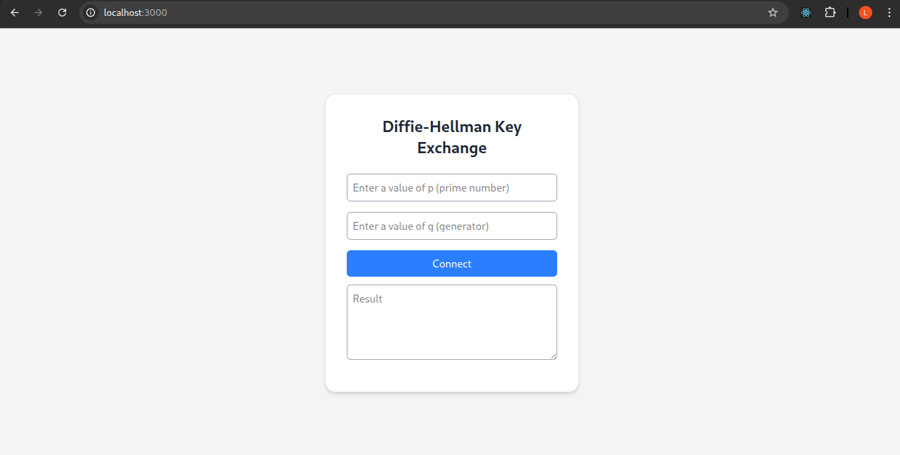
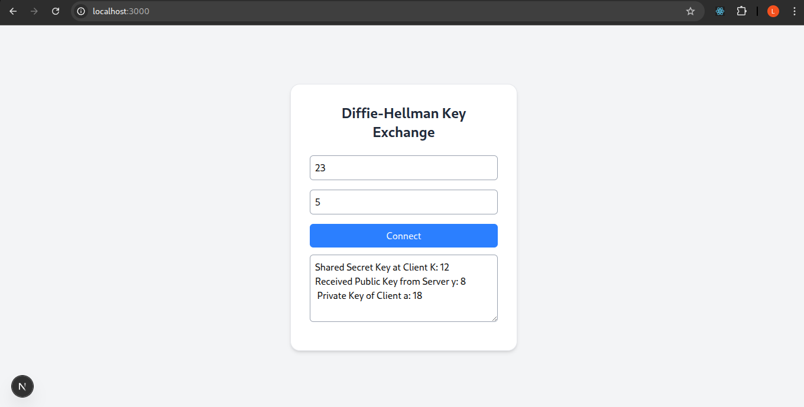

# 🔐 Client–Server Diffie–Hellman Key Exchange using WebAssembly and Native C (WASM + Next.js)

A Web-based Diffie–Hellman Key Exchange System demonstrating how native C code can be executed on both:

* Client → via WebAssembly (WASM)
* Server → via a natively compiled C binary

to compute modular exponentiation securely and efficiently.

This project shows end-to-end integration of:  
C → WebAssembly → JavaScript → Next.js Frontend → Next.js API → Native C  
to establish a shared secret key between a client and a server.

---

## 🧭 Project Overview

This project was developed to demonstrate how Diffie–Hellman Key Exchange (DHKE) can be implemented in a modern web environment:

* Client-side exponentiation (g^a mod p) happens using C compiled to WASM

* Server-side exponentiation (g^b mod p and x^b mod p) happens using native C executed from Next.js

The system performs the complete DH key exchange:

1. Client randomly generates private key a

2. Computes x = gᵃ mod p using WASM

3. Sends <g, p, x> to server

4. Server generates private key b

5. Computes:
    * y = gᵇ mod p
    * K = xᵇ mod p

6. Returns <K, y> to the client

7. Client displays <a, y, K> as the shared secret key exchange result

---

## 🧰 Technologies Used

| **Category**      | **Technology**            | **Purpose**                                    |
| ----------------- | ------------------------- | ---------------------------------------------- |
| **Core Logic**    | C (modexp implementation) | Modular exponentiation used in DHKE            |
| **Client Engine** | WebAssembly (WASM)        | Execute modexp C code in browser               |
| **WASM Compiler** | Emscripten                | Compile C → WebAssembly + JS loader            |
| **Frontend**      | Next.js (React)           | UI and client computations                     |
| **Backend**       | Next.js API Routes        | Execute native C program using `child_process` |
| **Runtime**       | Native GCC C binary       | Fast server-side modular exponentiation        |
| **Styling**       | TailwindCSS               | Responsive UI                                  |


---

## 🌐 Key Features

🌐 Key Features

🔐 Real Diffie–Hellman Key Exchange between client & server

🔐 Real Diffie–Hellman Key Exchange between client and server 

⚙️ Client uses WASM to compute gᵃ mod p 

⚙️ Server uses native C to compute gᵇ mod p and xᵇ mod p 

🔄 JSON-based communication between client and server 

📡 Server API executes native C using execFile 

📊 UI displays:
* Shared secret key K
* Server public key y
* Client private key a

🎨 Clean UI for entering p and g, and generating values

---

## 🎯 Objective

To learn how native C programs can be compiled to WebAssembly and used inside a Next.js frontend, while also executing native C on the backend to perform:

* Fast modular exponentiation

* Full Diffie–Hellman key exchange


---

## 📚 Learning Outcomes

✔️ How to compile C → WebAssembly using Emscripten 

✔️ How to expose C functions to JavaScript using Emscripten bindings 

✔️ How to load and use WASM modules in Next.js 

✔️ How to execute native C programs from a Next.js API route 

✔️ How to pass data between WASM memory and JS 

✔️ How Diffie–Hellman Key Exchange works internally

---

## 🛠️ Steps Implemented

### **Step 1: Implement Modular Exponentiation in C**

* A complete Modexp implementation **result = (g^a) mod p** was written manually (no libraries).
* The file is located at:
  `src/modexp.c`

### **Step 2: Compile C ➝ WebAssembly using Emscripten**

Commands used:

```bash
emcc modexp.c -O3 \
   -s WASM=1 \
   -s MODULARIZE=1 \
   -s 'EXPORT_NAME="ModExpModule"' \
   -s EXPORTED_FUNCTIONS='["_modexp"]' \
   -s EXPORTED_RUNTIME_METHODS='["ccall","cwrap"]' \
   -o ../public/modexp.js
```

This generates:

* `modexp.wasm`
* `modexp.js` (JS glue code to load WASM)

Placed inside:

```
public/
│── modexp.js
└── modexp.wasm
```
### **Step 3: Compile Native C Binary for Server**
* gcc modexp.c -o modexp

```
src/
│── modexp.c
└── modexp
```

### **Step 4: Create Next.js Frontend**

Frontend includes:

* Input for prime number p
* Input for generator g
* Button to compute x = gᵃ mod p via WASM
* Sending <g, p, x> to backend API
* Display server response: K, y, and client private key a

Located in:

```
pages/index.js
hooks/useModExp.js
styles/global.css
```
### **Step 4: Create Next.js Backend(API)**
Server API endpoint executes native C using Node.js:
```
pages/api/useModExpApi.js
```
Backend performs:

* Random generation of b
* y = gᵇ mod p (native C)
* K = xᵇ mod p (native C)
* Returns <K, y> to the client

---

## ⚙️ Installation & Running Locally

### 🧩 Prerequisites

| Tool       | Description                 | Version |
| ---------- | --------------------------- | ------- |
| Node.js    | JavaScript runtime          | >= 20.x |
| Emscripten | C → WASM compiler toolchain | Latest  |
| GCC        | Native C compiler           |         |

### 🔧 Install Emscripten

```bash
git clone https://github.com/emscripten-core/emsdk.git
cd emsdk
./emsdk install latest
./emsdk activate latest
source ./emsdk_env.sh
```

### 1️⃣ Clone the repository

```bash
git clone https://github.com/MTech-IT-MNS-2025/Group-3.git
cd Lab_Test_MNS2025028
```

### 2️⃣ Install dependencies

```bash
npm install
```

### 3️⃣ Build WASM + Start Next.js

```bash
npm run build
npm start
```

### 4️⃣ Open browser

👉 [http://localhost:3000](http://localhost:3000)

---

## 🗂️ Project Structure

```text
Lab_Test_MNS2025028/
├── hooks
│   └── useModExp.js
├── package.json
├── package-lock.json
├── pages
│   ├── api
│   │   └── useModExpApi.js
│   ├── _app.js
│   └── index.js
├── postcss.config.js
├── public
│   ├── modexp.js
│   └── modexp.wasm
├── src
│   ├── modexp
│   └── modexp.c
├── styles
│   └── global.css
└── tailwind.config.js
```

---

## 🖼️ Screenshots

### 📸 Home Page UI



### 📸 Generate & Exchange Keys 




---

## 📜 License

This project is licensed under the MIT License.  
See the [LICENSE](../LICENSE) file for details.


---
